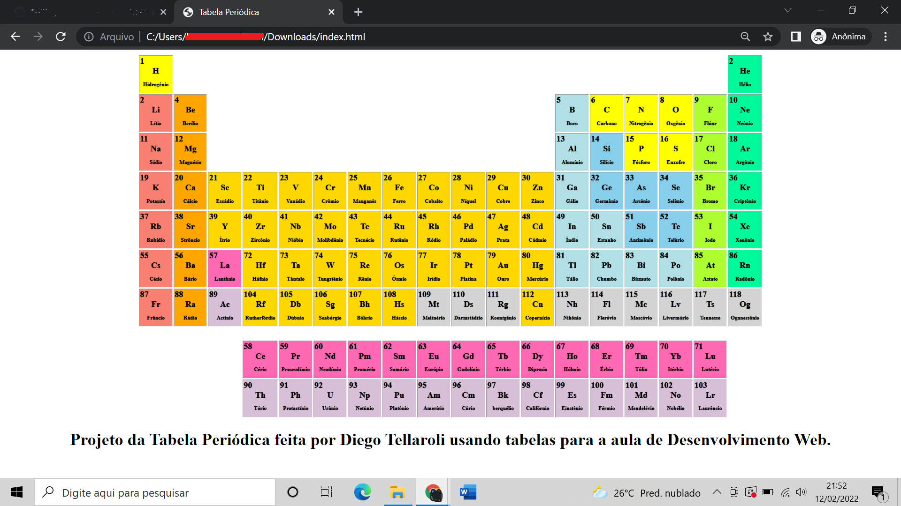

# Periodic-Table
A periodic table in HTM & CSS.

This was a project I developed while learning HTML and CSS at ETEC (Escola técnica estadual) in 2020, in web development classes. It's a periodic table made exclusively using TABLES in HTML. Just tables. The periodic table is in Brazilian Portuguese.

The code itself may not be the prettiest of all, as I was learning at the time, but the end result was very good. I had fun and learned new things while doing this project. So I decided to put it here as a memory.

